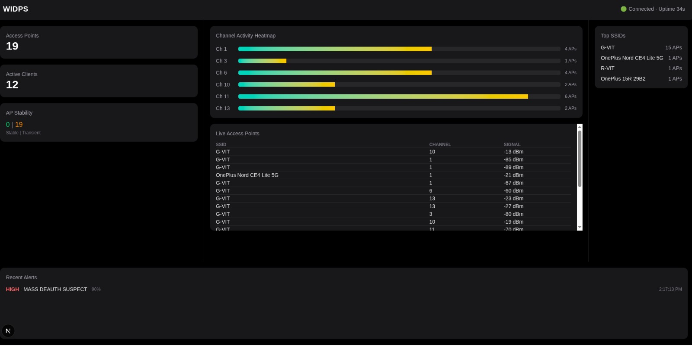

# WIDPS — WiFi Intrusion Detection and Protection System

WIDPS is a real-time WiFi Intrusion Detection and Protection System (WIDPS) designed to monitor wireless environments, detect malicious activity, and provide the foundation for automated protection mechanisms.

It combines:

- High-performance C++ sensor for packet ingestion  
- Modular Python detection and correlation engine  
- Protection-ready architecture (response layer extensible)  
- FastAPI backend with WebSocket streaming  
- Real-time dashboard UI  

---

# Live Dashboard Preview

<p align="center">
  
</p>

---

# System Architecture

```
                airodump-ng (Monitor Mode)
                          |
                          v
                C++ Sniffer (cpp_sniffer)
                          |
                     HTTP JSON Events
                          |
                          v
                FastAPI Backend (data_layer)
                          |
        -------------------------------------------
        |              |             |            |
     State Store   Detection     Correlation   Scoring
                                   Engine        Engine
                          |
                       Alerts
                          |
                      WebSocket
                          |
                          v
                    Dashboard UI
```

---

# Project Structure

```
root/
├── cpp_sniffer/
├── data_layer/
├── frontend/
├── docker-compose.yml
├── run_sniffer.sh
```

---

# Sensor Layer — cpp_sniffer

The C++ sniffer is responsible for ingesting wireless telemetry from airodump-ng and forwarding structured events to the backend.

Responsibilities:

- Tailing airodump CSV in real time  
- Detecting file rotation safely  
- Parsing AP and Client sections  
- Converting entries into structured JSON  
- Posting events to backend via HTTP  
- Retrying failed requests  
- Graceful shutdown handling  

Runtime Modes:

READ_EXISTING=1  
- Reads entire CSV once  
- Sends historical records  
- Switches to live tail mode  

LIVE_ONLY (default)  
- Primes parser with header  
- Tails only new incoming records  

Build:

```
cd cpp_sniffer/build
cmake ..
make
```

---

# Data Layer — data_layer

The data layer is the core detection engine of WIDPS.

Responsibilities:

- Ingest validation  
- Thread-safe in-memory state management  
- Temporal identity tracking  
- Stability classification  
- Detection modules  
- Correlation engine  
- Threat scoring  
- Alert generation  
- Telemetry broadcasting  

---

# How To Run

## 1. Start Backend

```
docker compose up --build
```

Backend runs at:

```
http://localhost:8000
```

## 2. Run Sniffer

```
./run_sniffer.sh
```

This script:

- Enables monitor mode  
- Starts airodump-ng  
- Builds C++ sniffer  
- Streams events to backend  

## 3. Start Frontend

```
cd frontend
npm install
npm run dev
```

Dashboard:

```
http://localhost:3000/dashboard
```

---

# Engineering Highlights

- Real-time wireless telemetry ingestion  
- File-rotation-aware CSV tailing  
- Thread-safe state store  
- Temporal identity tracking (first_seen, seen_count)  
- Stability classification (STABLE vs TRANSIENT)  
- Signal history tracking  
- Modular detection architecture  
- WebSocket live telemetry streaming  

---

# Future Roadmap

- Automated protection actions  
- Rogue AP confidence scoring  
- ML-based anomaly detection  
- Persistent event storage  
- Multi-sensor distributed deployment  

---

# Demo

The system provides real-time visualization of:

- Access point distribution  
- Channel congestion heatmap  
- Stability classification  
- Top SSIDs  
- Active clients  
- Security alerts  

A short demo video or GIF can be added in the `assets/` directory and embedded here if required.
